# Depuração e Teste de Algorimos

"escrever código corresponde a 90% de programação; o debugging do código representa os outros 90%" FURTADO, A. L. Python: Programação para Leigos. Rio de Janeiro: Alta Books, 2021. Capítulo 10

## O que é Depuração de Código (DEBUGGING)

### Definição: Depuração é o processo de encontrar, isolar e resolver erros de codificação conhecidos como bugs em programas de software. A depuração ajuda a descobrir a causa de erros de codificação, evitar problemas de função do software e melhorar o desempenho geral do software. **Camilo Quiroz-Vázquez**

------------------------------------------------------------------------

```{plantuml exemplo01-08-08, plantuml.path="images"}
@startuml
title Processo de Depuração de Software

start

:Etapa 1 - Reproduzir as condições;
:Etapa 2 - Encontrar o erro (bug);
:Etapa 3 - Determinar a causa raiz;
:Etapa 4 - Corrigir o bug;
:Etapa 5 - Testar para validar a correção;
:Etapa 6 - Documentar o processo;

:Tipos de Erros;

stop
@enduml
```

Compreender as diferentes categorias de falhas que podem ocorrer em um sistema ajuda engenheiros e desenvolvedores a escolherem a estratégia mais adequada para corrigir problemas no código sempre que um erro aparece. Entre essas situações, destacam-se alguns tipos comuns de erros que demandam atividades de depuração:

------------------------------------------------------------------------

## Tipos de Erros a depurar em um programa

### Erros semânticos

Erro semântico ocorre quando o computador entende o código, mas o significado do que foi escrito não corresponde ao que o programador pretendia. O código está sintaticamente correto, mas o significado da instrução está errado dentro do contexto do problema.

``` python
idade = "25"
resultado = idade + idade
print(resultado)
```
Saída

``` batch
2525
```

------------------------------------------------------------------------

### Erros de sintaxe

Um erro de sintaxe ocorre quando o código não segue as regras gramaticais da linguagem de programação. O interpretador (ou compilador) não consegue entender o código. O código não chega a executar.

``` python
if x > 10
    print(x)
```

Saída

``` batch
erro
```

O que falta neste código ?

------------------------------------------------------------------------

### Erros lógicos

Um erro lógico acontece quando o código está sintaticamente correto e faz sentido para o computador, mas a lógica usada para resolver o problema está errada.

``` python
x = 10
y = 5
media = x + y / 2
print("A média entre 10 e 5 é : , "media)
```

Saída

``` batch
12,5
```

------------------------------------------------------------------------

## Ferramentas de Depuração

### Ambientes de desenvolvimento integrados (IDEs)

Uma IDE (Integrated Development Environment — **Ambiente de Desenvolvimento Integrado**) é um software que reúne, em um único lugar, todas as ferramentas necessárias para desenvolver programas. Em vez de usar vários programas separados (editor, compilador, depurador), a IDE integra tudo em uma única interface.

### Antes: SEM UTILIZAR IDEs

+-----------------------------------+----------------------------+---------------------------------------------+
| Editor de código                  | Notepad++                  |              |
+-----------------------------------+----------------------------+---------------------------------------------+
| Executor/Compilador               | **Python.exe ( "MS-DOS")** | 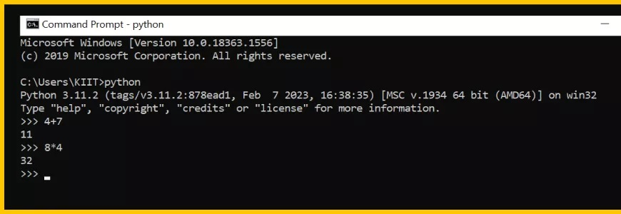                  |
+-----------------------------------+----------------------------+---------------------------------------------+
| Depurador (Debugger)              | **PYTHON TUTOR (WEB)**     | 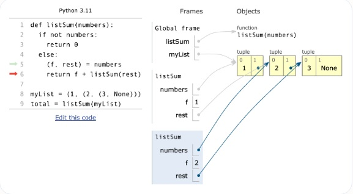          |
+-----------------------------------+----------------------------+---------------------------------------------+
| Gerenciador de projeto (Arquivos) | **windows explorer**       | 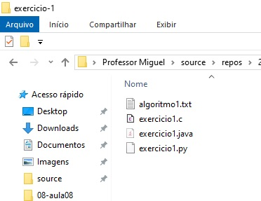 |
+-----------------------------------+----------------------------+---------------------------------------------+

### Agora: UTILIZANDO IDEs

+--------------------------+--------------------------------------------+
| -   Editor de Arquivos;  | 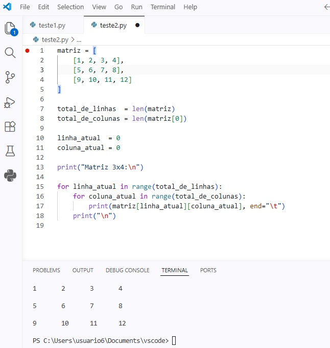               |
|                          |                                            |
| -   Compilador/Executor; |                                            |
|                          |                                            |
| -   Depurador;           |                                            |
|                          |                                            |
| -   Gestor de Projetos;  |                                            |
+--------------------------+--------------------------------------------+

#### Exemplos de IDEs para linguagem Python:

+------------------------------------------------------------------------------+------------------------------------+
| [Microsoft VSCODE](https://code.visualstudio.com/download)                   |        |
+------------------------------------------------------------------------------+------------------------------------+
| [Microsoft Visual Studio 2022](https://visualstudio.microsoft.com/pt-br/vs/) | 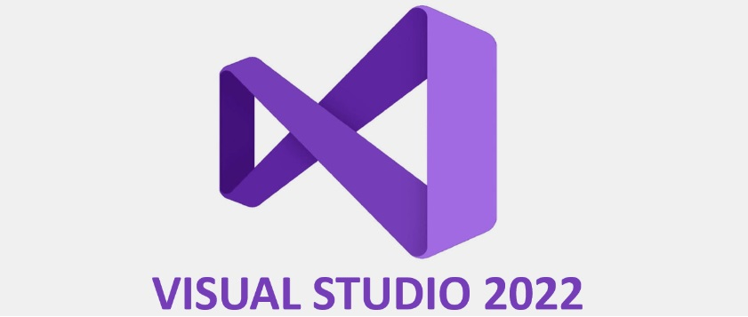 |
+------------------------------------------------------------------------------+------------------------------------+
| [Spyder](https://www.spyder-ide.org/)                                        | 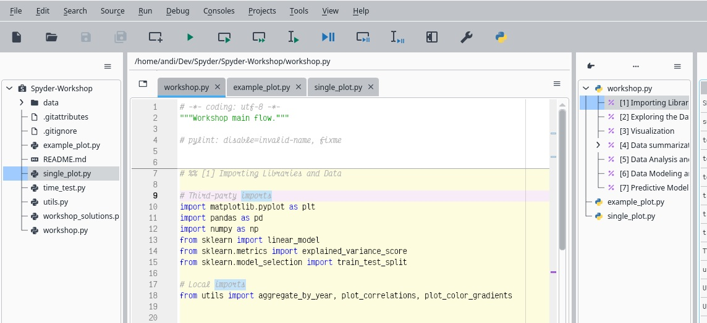       |
+------------------------------------------------------------------------------+------------------------------------+

## Depurando na I.D.E.

-   **Breakpoints (Pontos de Parada)**

```         
Interrompem a execução do código em uma linha específica para examinar o estado das variáveis.
```

-   **Step-By-Step (Passo-a-Passo)**

```         
Executar linha por linha (Step Into, Step Over, Step Out) para rastrear o fluxo lógico.
```

Exemplo no Microsoft VSCode

Você deseja monitorar a execução do seguinte código passo-a-passo:

``` python
print("linha 1")
print("linha 2")
print("linha 3")
print("linha 4")
print("linha 5")
print("linha 6")
print("linha 7")
print("linha 8")
print("linha 9")
print("linha 10")

variavel1 = 3;
variavel2 = 11;
```

### Executando o código normalmente (sem depurar) no VSCode:

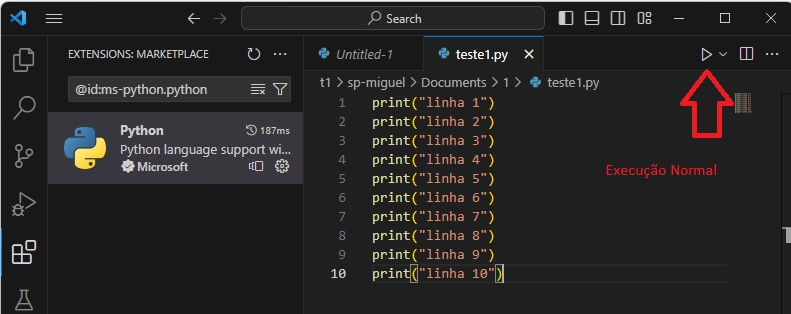

Todas as linhas saem no terminal

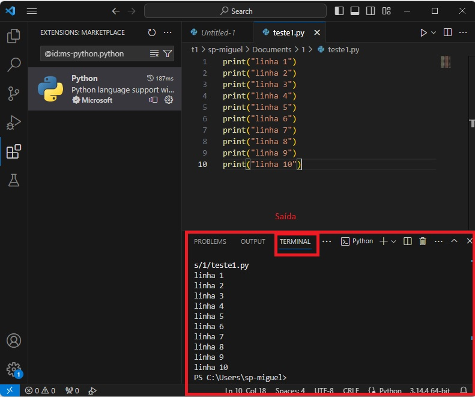

### Executando o código depurando no VSCode (DEBUGGING):

1)  passo - Colocando um BreakPoint

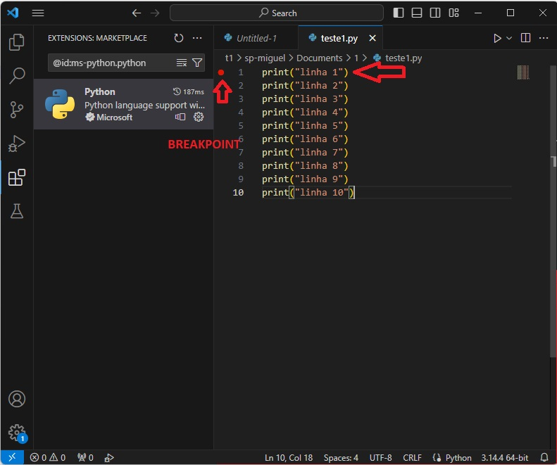

2)  passo - Inicializando a depuração

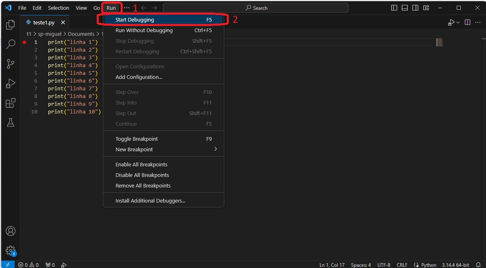

3)  passo - Selecionando o depurador padrão do Python

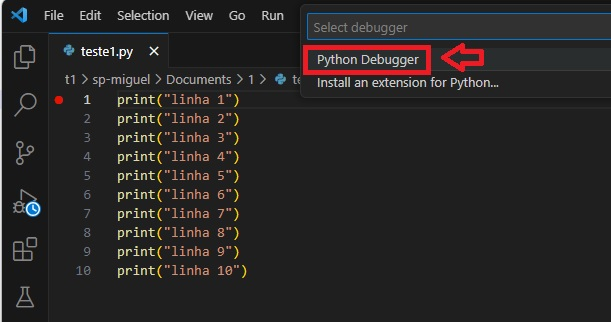

4)  passo - Avisando que você vai depurar um arquivo comum

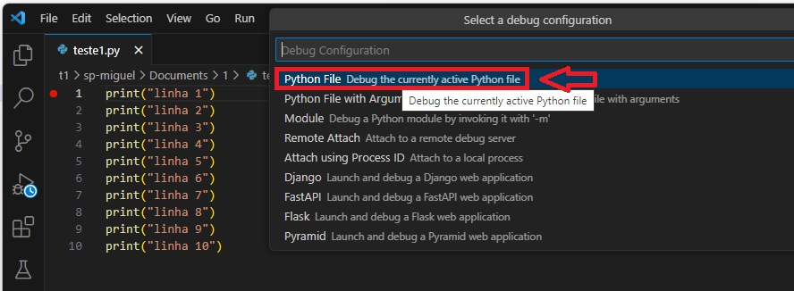

5)  passo - Fazendo e execução passo-a-passo (Step By Step) - Tecla de atalho F10

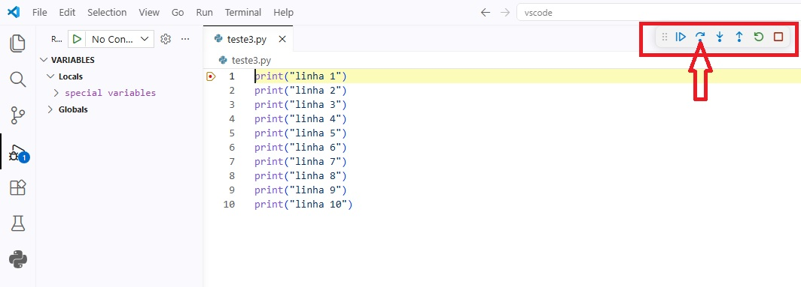

6)  passo - Fazendo e execução passo-a-passo (Step By Step) - Tecla de atalho F10

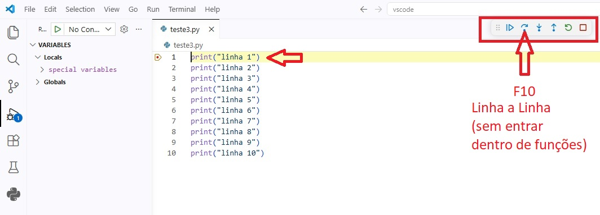

7)  passo - Cada vez que você pressionar F11, vai a próxima linha. Caso exista uma função, você não irá entrar dentro dela.

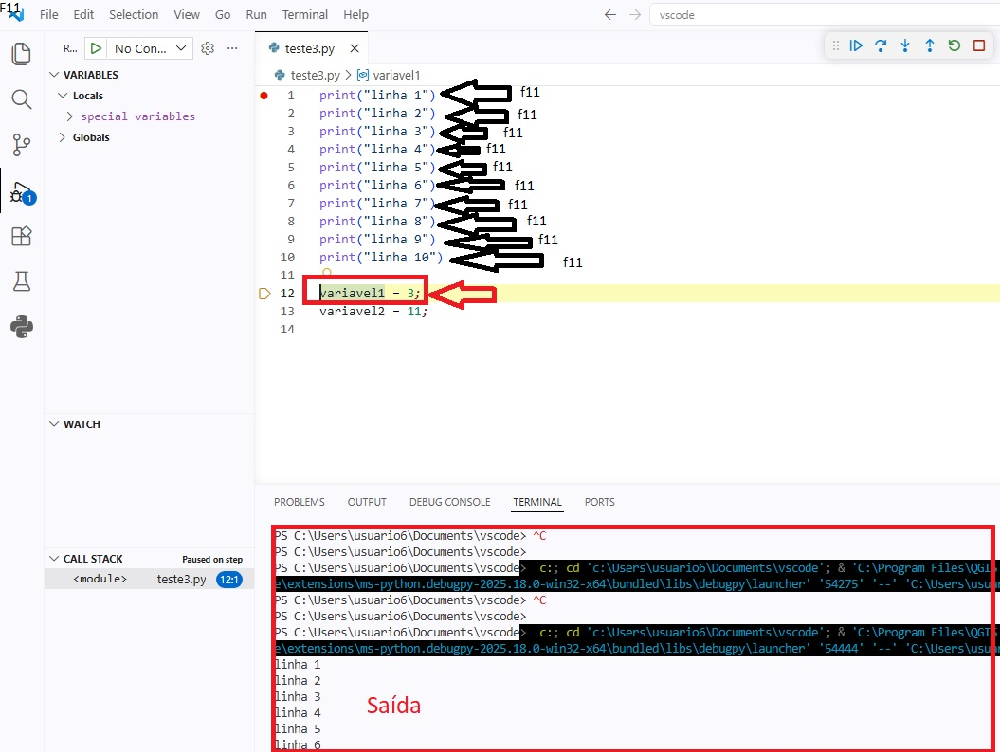

8)  passo - Ao encontrar uma variável, podemos inspecionar seu conteúdo. Passe o mouse acima do nome da variável e com o botão do mouse, selecione a opção "add Watch".

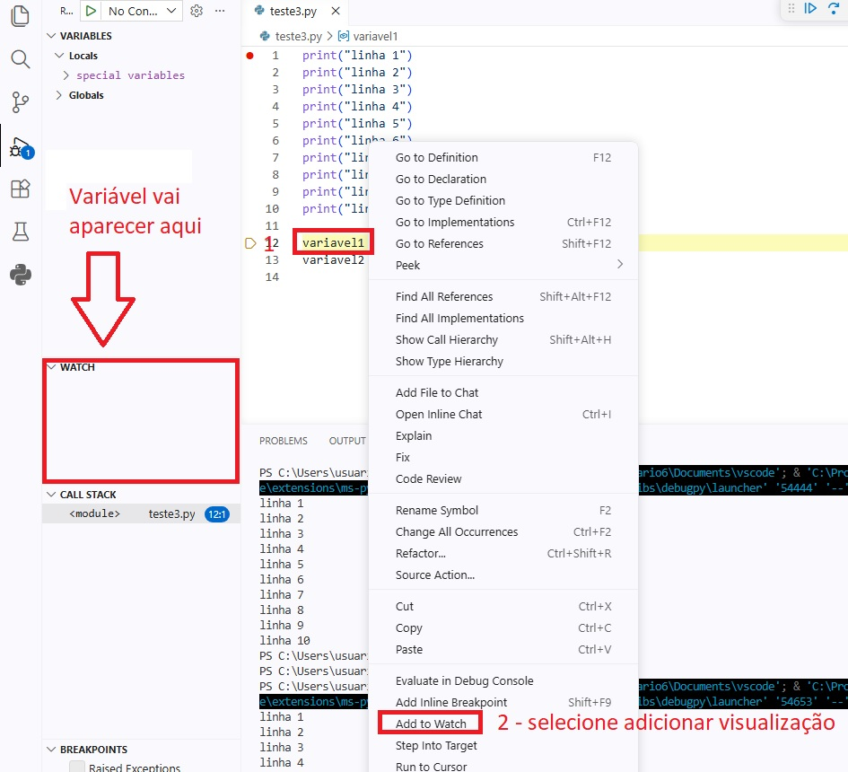

A Variável selecionada, passa a aparecer na área da visualização (quadrinho watch).

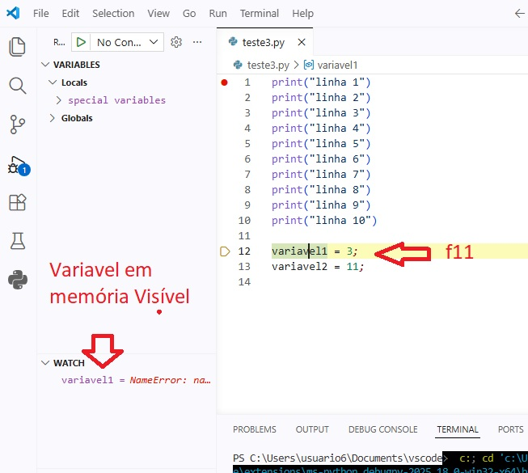

Para toda variável de interesse, você pode adicioná-la da tela de exibição repetindo o processo.

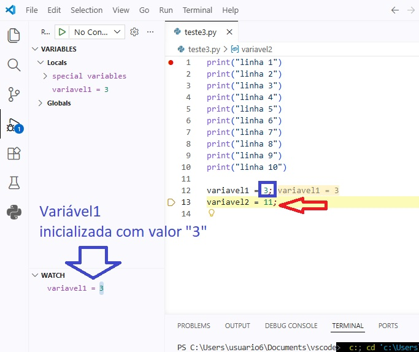

Se precisar sair do programa, basta pressionar SHIFT+F5;

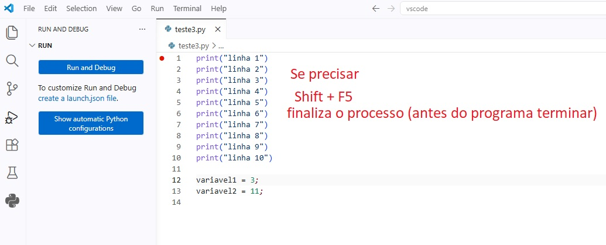

## REFERÊNCIAS:

Quiroz-Vázquez, Camilo - IBM. Debugging: o que é e como funciona. [S.l.: s.n.], [s.d.]. Disponível em: <https://www.ibm.com/br-pt/think/topics/debugging>. Acesso em: 22 abr. 2026. FURTADO, A. L. Python: Programação para Leigos. Rio de Janeiro: Alta Books, 2021. Capítulo 10

```{r 08-Depuracao-08-aula-html, eval=FALSE, include=FALSE}
rmarkdown::render("08-2026-04-22_Depuracao_e_Teste_Algoritmos.Rmd", output_dir="docs", output_file ="temporario.html" , output_format = "html_document") ; utils::browseURL("docs/temporario.html")
```
