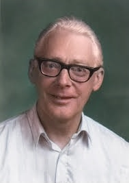
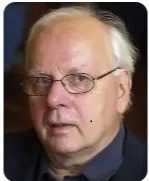

# Programação Orientada a Objetos - Parte 1

## **Breve História e Criadores**

A Orientação a Objetos (OO) surgiu na década de 1960, fundamentada no conceito de **Simulação** (simular eventos do dia a dia em sistemas digitais). \* **Os Criadores:** Em 1962, os pesquisadores noruegueses **Kristen Nygaard e Ole-Johan Dahl** aceitaram o desafio de criar uma linguagem de simulação de eventos discretos, batizada de **Simula 67**, considerada a primeira linguagem OO de renome. \* **Popularização:** Na década de 70, **Alan Kay** criou o **Smalltalk**, que efetivamente tornou a OO conhecida, introduzindo interfaces gráficas e o conceito de que "tudo é objeto". A popularização massiva ocorreu nos anos 90 com o Java.

|  |  |
|----------------------|--------------------------------------------------|
|  | {width="222"} |

: Da esquerda para direita: Ole-Johan Dahl e Kristen Nygaard - Criadores da primeira Linguagem OO reconhecida: Simula 67

```{plantuml linha_do_tempo-09-09, plantuml.path="images"}
@startuml
title Infográfico — Linha do Tempo da Programação Orientada a Objetos

skinparam backgroundColor #FAFAFA
skinparam shadowing true
skinparam roundcorner 20
skinparam defaultFontName Arial
skinparam defaultFontSize 14

skinparam rectangle {
  BackgroundColor #EAF3FF
  BorderColor #2B5C9E
  FontColor #111111
}


skinparam note {
  BackgroundColor #FFF4CC
  BorderColor #C9A227
  FontColor #111111
}

top to bottom direction

rectangle "1967\nSimula 67" as simula
rectangle "1972\nSmalltalk" as smalltalk
rectangle "1980\nC++" as cpp
rectangle "1984\nEiffel" as eiffel
rectangle "1995\nJava" as java

simula --> smalltalk
smalltalk --> cpp
cpp --> eiffel
eiffel --> java

note right of simula
Criadores:
Ole-Johan Dahl
Kristen Nygaard

Contribuições:
• Primeira linguagem OO reconhecida
• Classes e objetos
• Herança
• Simulação de sistemas
end note

note right of smalltalk
Criador:
Alan Kay
(Adele Goldberg, Dan Ingalls)

Contribuições:
• Tudo é objeto
• Comunicação por mensagens
• Interface gráfica (GUI)
end note

note right of cpp
Criador:
Bjarne Stroustrup

Contribuições:
• Extensão OO do C
• Herança múltipla
• Polimorfismo
end note

note right of eiffel
Criador:
Bertrand Meyer

Contribuições:
• Design by Contract
• Qualidade e confiabilidade
end note

note right of java
Criador:
James Gosling

Contribuições:
• Portabilidade (JVM)
• Uso corporativo e web
• Garbage Collector
end note

@enduml
```

## **Paradigma Procedural (Estruturado) vs. Orientado a Objetos**

### **Paradigma Procedural:**

Foca no **"como fazer"**. Baseia-se em três estruturas: **sequência**, **decisão** e **iteração**. O problema principal é a **Lacuna Semântica**, ou seja, a dificuldade de **representar a realidade de forma direta**, pois **dados** e **operações** ficam **desassociados** no código.

| **PARADIGMA DE PROGRAMAÇÃO PROCEDIMENTAL (ESTRUTURADA)** | **CARACTERÍSTICAS** |
|:----------------------:|:---------------------------------------------:|
| Filosofia | executar **sequência**, **decisão** e **iteração** |
| Dados e Operações CORRELACIONADAS | ficam separados |
| Representação da REALIDADE | Fraca |

: Características do paradigma de programação estruturada segundo CARVALHO [1]

```{plantuml paradigma-estrutural, plantuml.path="images"}
@startuml
title Paradigma Procedural (ou Estruturado)

skinparam backgroundColor #FAFAFA
skinparam roundcorner 18
skinparam shadowing true
skinparam defaultFontName Arial
skinparam defaultFontSize 14

skinparam rectangle {
  BackgroundColor #EAF3FF
  BorderColor #2B5C9E
}

top to bottom direction

rectangle "Sequência\nPasso 1 → Passo 2 → Passo 3 → ... FIM " as sequencia #FFF4CC {

  rectangle "Escreva na tela !"             as escrevatela
  rectangle "Leia do teclado..."            as leiateclado
  rectangle "Decisão\nse... então... senão" as decisao
  rectangle "Iteração\nrepetir enquanto..." as iteracao
  rectangle "FIM do Programa"               as final

  escrevatela --> leiateclado
  leiateclado --> decisao
  decisao     --> iteracao
  iteracao    --> final
}

@enduml
```

Exemplo 1 : Faça uma calculadora em Python utilizando programação estruturada (a que você utilizou até agora):

``` python
def somar(a, b):
    return a + b

def subtrair(a, b):
    return a - b

def multiplicar(a, b):
    return a * b

def dividir(a, b):
    if b == 0:
        return "Erro: divisão por zero"
    return a / b


numero1 = 10
numero2 = 5

print("Soma:", somar(numero1, numero2))
print("Subtração:", subtrair(numero1, numero2))
print("Multiplicação:", multiplicar(numero1, numero2))
print("Divisão:", dividir(numero1, numero2))
```

```{plantuml calculadora-paradigma-estrutural, plantuml.path="images"}
@startuml
title D.F.D. - Diagrama de Fluxo de dados  \n Calculadora Procedural em Python

start

:numero1 ← 10;
:numero2 ← 5;

:Soma ← numero1 + numero2;
:Exibir "Soma:", Soma;

:Subtração ← numero1 - numero2;
:Exibir "Subtração:", Subtração;

:Multiplicação ← numero1 * numero2;
:Exibir "Multiplicação:", Multiplicação;

if (numero2 == 0?) then (Sim)
  :Exibir "Erro: divisão por zero";
else (Não)
  :Divisão ← numero1 / numero2;
  :Exibir "Divisão:", Divisão;
endif

stop

@enduml
```

------------------------------------------------------------------------

### **Paradigma Orientado a Objetos:**

Foca no **"o que deve ser feito"**. Procura diminuir a Lacuna Semântica, criando unidades de código mais próximas da forma como pensamos e agimos.

| **PARADIGMA DE PROGRAMAÇÃO ORIENTADA A OBJETOS** | **CARACTERÍSTICAS** |
|:--------------------------:|:------------------------------------------:|
| Filosofia | **REUSO**, **COESÃO** e **ACOPLAMENTO** no código |
| Dados e Operações CORRELACIONADAS | ficam juntos |
| Representação da REALIDADE | Forte |

: Características do paradigma de programação Orientada a Objetos segundo CARVALHO [1]

Exemplo 1 continuação: Converta a calculadora em Python que você criou utilizando programação estruturada para o paradigma de programação Orientada a Objetos:

``` python
class Calculadora:
    def __init__(self, numero1, numero2):
        self.numero1 = numero1
        self.numero2 = numero2

    def somar(self):
        return self.numero1 + self.numero2

    def subtrair(self):
        return self.numero1 - self.numero2

    def multiplicar(self):
        return self.numero1 * self.numero2

    def dividir(self):
        if self.numero2 == 0:
            return "Erro: divisão por zero"
        return self.numero1 / self.numero2


calc = Calculadora(10, 5)

print("Soma:", calc.somar())
print("Subtração:", calc.subtrair())
print("Multiplicação:", calc.multiplicar())
print("Divisão:", calc.dividir())
```

#### Representação da estrutura do programa

```{plantuml calculadora-uml-diagrama-classes, plantuml.path="images"}
@startuml
title Diagrama de Classes UML \n Calculadora Orientada a Objetos em Python

skinparam classAttributeIconSize 0
skinparam shadowing true
skinparam roundcorner 15

class Calculadora {
  - numero1 : float
  - numero2 : float
  
  + __init__(numero1: float, numero2: float)
  + somar() : float
  + subtrair() : float
  + multiplicar() : float
  + dividir() : float | string
}

note right of Calculadora
A classe Calculadora armazena
dois números e fornece operações
aritméticas sobre eles.

O método dividir trata
divisão por zero.
end note

@enduml
```

#### Representação do fluxo de execução do programa

```{plantuml calculadora-uml-diagrama-sequencia, plantuml.path="images"}
@startuml
title Diagrama de Sequência UML \n Calculadora Orientada a Objetos em Python

scale max 1920 width

skinparam ParticipantPadding 150
skinparam BoxPadding 10
skinparam SequenceMessageAlign center
skinparam shadowing true

actor Usuario

participant "Programa Principal" as Main
participant "Objeto Calculadora" as Calc

Usuario -> Main : iniciar programa

Main -> Calc : __init__(10, 5)
activate Calc
Calc --> Main : objeto criado e preenchido com valores iniciais
deactivate Calc

Main -> Calc : somar()
activate Calc
Calc --> Main : 15
deactivate Calc
Main -> Main : print("Soma", 15)

Main -> Calc : subtrair()
activate Calc
Calc --> Main : 5
deactivate Calc
Main -> Main : print("Subtração", 5)

Main -> Calc : multiplicar()
activate Calc
Calc --> Main : 50
deactivate Calc
Main -> Main : print("Multiplicação", 50)

Main -> Calc : dividir()
activate Calc
Calc --> Main : 2
deactivate Calc

Main -> Main : print("Divisão", 2)

@enduml
```

-   **Vantagens da OO:** Melhor expressividade, maior reúso de código, facilidade de manutenção e criação de sistemas mais complexos com menor acoplamento.

``` python
```

------------------------------------------------------------------------

## **Conceitos Estruturais (Exemplos em Python)**

-   **Classe:** É o "molde" ou abstração base a partir da qual os objetos são criados.
-   **Atributo:** Define a estrutura de dados e as características da classe.
-   **Método:** Define as ações ou comportamentos que a classe oferece.
-   **Objeto:** É a instância (realização) de uma classe.

| Conceito OO | Conceito Relacional | Descrição                     |
|-------------|---------------------|-------------------------------|
| Classe      | Tabela              | Estrutura que define o modelo |
| Atributo    | Coluna              | Característica (campo)        |
| Objeto      | Linha (registro)    | Instância completa da tabela  |

: Semelhança do papel estrutural utilizado por Linguagens Orientadas a Objeto e componentes de tabelas (Bancos de Dados).

**Exemplo em Python:**

``` python
class Personagem:
    def __init__(self, nome, altura): # Construtor (método especial)
        self.nome = nome              # Atributo
        self.altura = altura

    def pular(self):                  # Método
        print(f"{self.nome} pulou!")

# Instanciação de Objetos
mario = Personagem("Mario", 1.60)
mario.pular() # Mensagem enviada ao objeto
```

## **Referências**

CARVALHO, Thiago Leite e. **Orientação a Objetos**: aprenda seus conceitos e suas aplicabilidades de forma efetiva. 1. ed. [S.l.]: Casa do Código, [ano não informado].

```{r aula-09-orirntecao-objetos-parte1-aula-html, eval=FALSE, include=FALSE}
rmarkdown::render("09-2026-04-29_Programacao_OO-parte1.Rmd", output_dir="docs", output_file ="temporario.html" , output_format = "html_document") ; utils::browseURL("docs/temporario.html")
```

```{r aula-09-orirntecao-objetos-parte1-aula-word, eval=FALSE, include=FALSE}
rmarkdown::render("09-2026-04-29_Programacao_OO-parte1.Rmd", output_dir="docs", output_file ="temporario.docx" , output_format = "word_document") ; utils::browseURL("docs/temporario.docx")
```
