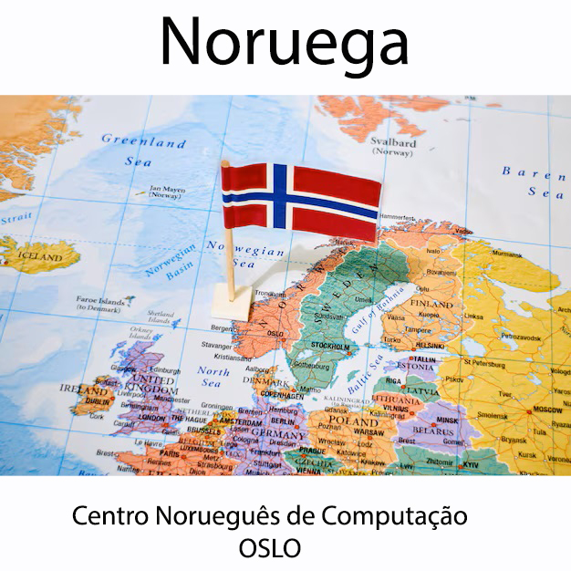

# Programação Orientada a Objetos - Parte 1

A principal razão que levou cientistas da computação a criarem o paradigma de programação orientado a objetos foi a abstração. Já nos anos 1960, era percebida uma dificuldade dos engenheiros de software em mapear problemas do mundo real em linguagens de programação da época.

As linguagens de programação de então não davam suporte a um mapeamento claro de objetos do mundo real a variáveis e funções existentes nos códigos dos programas, naquele momento. A prórpia gramática, a estrutura léxica e sintática das linguagens parecia dificultar essa tafera.

## **Breve História e Criadores**

A Orientação a Objetos (OO) surgiu na década de 1960, fundamentada no conceito de **Simulação** (simular eventos do dia a dia em sistemas digitais). \* **Os Criadores:** Em 1962, os pesquisadores noruegueses **Kristen Nygaard e Ole-Johan Dahl** aceitaram o desafio de criar uma linguagem de simulação de eventos discretos, batizada de **Simula 67**, considerada a primeira linguagem OO de renome. \* **Popularização:** Na década de 70, **Alan Kay** criou o **Smalltalk**, que efetivamente tornou a OO conhecida, introduzindo interfaces gráficas e o conceito de que "tudo é objeto". A popularização massiva ocorreu nos anos 90 com o Java.

|  |  |  |
|-----------------------|-------------------------|------------------------|
|  | {width="222"} |  |

: Da esquerda para direita: Ole-Johan Dahl e Kristen Nygaard - Criadores da primeira Linguagem OO reconhecida: Simula 67

```{plantuml linha_do_tempo-09-09, plantuml.path="images"}
@startuml
title Infográfico — Linha do Tempo da Programação Orientada a Objetos

skinparam backgroundColor #FAFAFA
skinparam shadowing true
skinparam roundcorner 20
skinparam defaultFontName Arial
skinparam defaultFontSize 14

skinparam rectangle {
  BackgroundColor #EAF3FF
  BorderColor #2B5C9E
  FontColor #111111
}


skinparam note {
  BackgroundColor #FFF4CC
  BorderColor #C9A227
  FontColor #111111
}

top to bottom direction

rectangle "1967\nSimula 67" as simula
rectangle "1972\nSmalltalk" as smalltalk
rectangle "1980\nC++" as cpp
rectangle "1984\nEiffel" as eiffel
rectangle "1995\nJava" as java

simula --> smalltalk
smalltalk --> cpp
cpp --> eiffel
eiffel --> java

note right of simula
Criadores:
Ole-Johan Dahl
Kristen Nygaard

Contribuições:
• Primeira linguagem OO reconhecida
• Classes e objetos
• Herança
• Simulação de sistemas
end note

note right of smalltalk
Criador:
Alan Kay
(Adele Goldberg, Dan Ingalls)

Contribuições:
• Tudo é objeto
• Comunicação por mensagens
• Interface gráfica (GUI)
end note

note right of cpp
Criador:
Bjarne Stroustrup

Contribuições:
• Extensão OO do C
• Herança múltipla
• Polimorfismo
end note

note right of eiffel
Criador:
Bertrand Meyer

Contribuições:
• Design by Contract
• Qualidade e confiabilidade
end note

note right of java
Criador:
James Gosling

Contribuições:
• Portabilidade (JVM)
• Uso corporativo e web
• Garbage Collector
end note

@enduml
```

## **Paradigma Procedural (Estruturado) vs. Orientado a Objetos**

### **Paradigma Procedural:**

Foca no **"como fazer"**. Baseia-se em três estruturas: **sequência**, **decisão** e **iteração**. O problema principal é a **Lacuna Semântica**, ou seja, a dificuldade de **representar a realidade de forma direta**, pois **dados** e **operações** ficam **desassociados** no código.

| **PARADIGMA DE PROGRAMAÇÃO PROCEDIMENTAL (ESTRUTURADA)** | **CARACTERÍSTICAS** |
|:-----------------------:|:---------------------------------------------:|
| Filosofia | executar **sequência**, **decisão** e **iteração** |
| Dados e Operações CORRELACIONADAS | ficam separados |
| Representação da REALIDADE | Fraca |

: Características do paradigma de programação estruturada segundo CARVALHO [1]

```{plantuml paradigma-estrutural, plantuml.path="images"}
@startuml
title Paradigma Procedural (ou Estruturado)

skinparam backgroundColor #FAFAFA
skinparam roundcorner 18
skinparam shadowing true
skinparam defaultFontName Arial
skinparam defaultFontSize 14

skinparam rectangle {
  BackgroundColor #EAF3FF
  BorderColor #2B5C9E
}

top to bottom direction

rectangle "Sequência\nPasso 1 → Passo 2 → Passo 3 → ... FIM " as sequencia #FFF4CC {

  rectangle "Escreva na tela !"             as escrevatela
  rectangle "Leia do teclado..."            as leiateclado
  rectangle "Decisão\nse... então... senão" as decisao
  rectangle "Iteração\nrepetir enquanto..." as iteracao
  rectangle "FIM do Programa"               as final

  escrevatela --> leiateclado
  leiateclado --> decisao
  decisao     --> iteracao
  iteracao    --> final
}

@enduml
```

## A Evolução do mode de mapear o mundo real em um sistema computacional: ABSTRAÇÃO, REUSO e ENCAPSULAMENTO

Para que uma lingauem de programação pudesse mapear melhor os objetos do mundo real, Dahl e Nygaard chegaram a conclusão que a linguagem precisaria suportar os seguintes requisitos:

Requisito 1 - **ABSTRAÇÃO**: representar as características essenciais de um objeto do mundo real ocultando detalhes desnecessários de sua implementação em código.

Exemplo de utilidade: A abstração facilita a criação de desenhos e diagramas de sistemas;

Requisito 2 - **REUSO**: reaproveitamento de código já criado. É a lógica da "peça de lego".

Exemplo de utilidade: O código que representa uma cadeira pode ser reaproveitado em sistemas BIM de arquitetura que criam uma sala de estar;

Requisito 3 - **ENCAPSULAMENTO**: ocultar a complexidade e proteger o acesso indevido a conteúdo de variáveis;

Exemplo de utilidade: ao chamar a função ***desenha_janela()**,* o desenvolvedor não precisa se preocupar com quais chamadas da biblioteca gráfica do sistema operacional serão utilizadas, focando apenas em atingir o objetivo funcional do seu sistema.

## OS CONCEITOS DE OO APARECENDO NO CÓDIGO

As linguagens antigas precisavam adicionar extensões para implantar os conceitos. A linguagem C, por exemplo, recebeu a adição de uma extensão de gramática e passou a se chamar C++ (linguagem C com suporte a orientação a objetos).

A linguagem JAVA já nasceu orientada a objetos e praticamente obriga o desenvolvedor a utilizar esse paradigma de programação.

A linguagem Python nasceu orientada a objetos com flexibilidade de paradigma;

| Conceito       | Recurso adicionado a linguagem |
|----------------|--------------------------------|
| ABSTRAÇÃO      | CLASSES                        |
| REUSO          | MECANISMO DE HERANÇA           |
| ENCAPSULAMENTO | MECANISMO DE ACESSO A CLASSE   |

: Conceitos x recursos da linguagem

### ABORDAGEM PRÁTICA DA TEORIA NA PROGRAMAÇÃO:

Para mim, que estou acostumado com programação estruturada e orientada a um fluxo, como entender um código orientado a objetos (no caso na linguagem python) ?

"OBJETOS SÃO VARIÁVEIS COMPOSTAS (POSSUEM "SUB-VARIÁVEIS") QUE TAMBÉM INCORPORAM FUNÇÕES. AS VARIÁVEIS DO TIPO OBJETO SÃO CRIADAS ATRAVÉS DE *ESTRUTURAS DE MOLDAGEM* CHAMAS CLASSES".

## ABSTRAÇÃO

Para mostrar o conceito de abstração, vamos comparar o mesmo programa feito nos 2 paradigmas diferente: atual **PARADIGMA ESTRUTURADO** e **PARADIGMA ORIENTADO A OBJETOS**

### COMPARAÇÃO DOS ESTILOS DE PROGRAMAÇÃO - UMA CALCULADORA

Exemplo 1 : Faça uma calculadora em Python utilizando programação estruturada (a que você utilizou até agora):

``` python
def somar(a, b):
    resultado_soma = (a + b)
    return resultado_soma

def subtrair(a, b):
    resultado_subtracao = (a - b)
    return resultado_subtracao

def multiplicar(a, b):
    resultado_multiplicacao = (a * b)
    return resultado_multiplicacao

def dividir(a, b):
    if b == 0:
        return "Erro: divisão por zero"
    resultado_divisao = (a / b)
    return resultado_divisao


numero1 = 10
numero2 = 5

print("Soma:", somar(numero1, numero2))
print("Subtração:", subtrair(numero1, numero2))
print("Multiplicação:", multiplicar(numero1, numero2))
print("Divisão:", dividir(numero1, numero2))
```

```{plantuml calculadora-paradigma-estrutural, plantuml.path="images"}
@startuml
title D.F.D. - Diagrama de Fluxo de dados  \n Calculadora Procedural em Python

start

:numero1 ← 10;
:numero2 ← 5;

:Soma ← numero1 + numero2;
:Exibir "Soma:", Soma;

:Subtração ← numero1 - numero2;
:Exibir "Subtração:", Subtração;

:Multiplicação ← numero1 * numero2;
:Exibir "Multiplicação:", Multiplicação;

if (numero2 == 0?) then (Sim)
  :Exibir "Erro: divisão por zero";
else (Não)
  :Divisão ← numero1 / numero2;
  :Exibir "Divisão:", Divisão;
endif

stop

@enduml
```

------------------------------------------------------------------------

### **Paradigma Orientado a Objetos:**

Foca no **"o que deve ser feito"**. Procura diminuir a Lacuna Semântica, criando unidades de código mais próximas da forma como pensamos e agimos.

| **PARADIGMA DE PROGRAMAÇÃO ORIENTADA A OBJETOS** | **CARACTERÍSTICAS** |
|:--------------------------:|:------------------------------------------:|
| Filosofia | **REUSO**, **COESÃO** e **ACOPLAMENTO** no código |
| Dados e Operações CORRELACIONADAS | ficam juntos |
| Representação da REALIDADE | Forte |

: Características do paradigma de programação Orientada a Objetos segundo CARVALHO [1]

Exemplo 1 continuação: Converta a calculadora em Python que você criou utilizando programação estruturada para o paradigma de programação Orientada a Objetos:

``` python
class Calculadora:
    def __init__(self, numero1, numero2):
        self.numero1 = numero1
        self.numero2 = numero2

    def somar(self):
        resultado_soma = ( self.numero1 + self.numero2 )
        return resultado_soma

    def subtrair(self):
        resultado_subtracao = ( self.numero1 + self.numero2 )
        return resultado_subtracao

    def multiplicar(self):
        resultado_multiplicacao = (self.numero1 + self.numero2)
        return resultado_multiplicacao

    def dividir(self):
        if self.numero2 == 0:
            return "Erro: divisão por zero"
        resultado_divisao = ( self.numero1 + self.numero2 )
        return resultado_divisao


objeto_calculadora1 = Calculadora(10, 5)

print("Soma         :" , objeto_calculadora1.somar())
print("Subtração    :" , objeto_calculadora1.subtrair())
print("Multiplicação:" , objeto_calculadora1.multiplicar())
print("Divisão      :" , objeto_calculadora1.dividir())
```

#### Representação da estrutura do programa

```{plantuml calculadora-uml-diagrama-classes, plantuml.path="images"}
@startuml
title Diagrama de Classes UML \n Calculadora Orientada a Objetos em Python

skinparam classAttributeIconSize 0
skinparam shadowing true
skinparam roundcorner 15

class Calculadora {
  - numero1 : float
  - numero2 : float
  
  + __init__(numero1: float, numero2: float)
  + somar() : float
  + subtrair() : float
  + multiplicar() : float
  + dividir() : float | string
}

note right of Calculadora
A classe Calculadora armazena
dois números e fornece operações
aritméticas sobre eles.

O método dividir trata
divisão por zero.
end note

@enduml
```

#### Representação do fluxo de execução do programa

```{plantuml calculadora-uml-diagrama-sequencia, plantuml.path="images"}
@startuml
title Diagrama de Sequência UML \n Calculadora Orientada a Objetos em Python

scale max 1920 width

skinparam ParticipantPadding 150
skinparam BoxPadding 10
skinparam SequenceMessageAlign center
skinparam shadowing true

actor Usuario

participant "Programa Principal" as Main
participant "Objeto Calculadora" as Calc

Usuario -> Main : iniciar programa

Main -> Calc : __init__(10, 5)
activate Calc
Calc --> Main : objeto criado e preenchido com valores iniciais
deactivate Calc

Main -> Calc : somar()
activate Calc
Calc --> Main : 15
deactivate Calc
Main -> Main : print("Soma", 15)

Main -> Calc : subtrair()
activate Calc
Calc --> Main : 5
deactivate Calc
Main -> Main : print("Subtração", 5)

Main -> Calc : multiplicar()
activate Calc
Calc --> Main : 50
deactivate Calc
Main -> Main : print("Multiplicação", 50)

Main -> Calc : dividir()
activate Calc
Calc --> Main : 2
deactivate Calc

Main -> Main : print("Divisão", 2)

@enduml
```

-   **Vantagens da OO:** Melhor expressividade, maior reúso de código, facilidade de manutenção e criação de sistemas mais complexos com menor acoplamento.

------------------------------------------------------------------------

## **Conceitos Estruturais (Exemplos em Python)**

-   **Classe:** É o "molde" ou abstração base a partir da qual os objetos são criados.
-   **Atributo:** Define a estrutura de dados e as características da classe.
-   **Método:** Define as ações ou comportamentos que a classe oferece.
-   **Objeto:** É a instância (realização) de uma classe.

| NOMENCLATURA - PARADIGMA PROGRAMAÇÃO ESTRUTURADA (OU PROCEDIMENTAL) - python | NOMENCLATURA - PARADIGMA PROGRAMAÇÃO ORIENTADA A OBJETOS - python |
|------------------------------------|------------------------------------|
| TIPO DE VARIAVEL ( inteiro, texto, real, booleano, listas, dicionários, clausuras e conjuntos ) | CLASSE |
| VARIÁVEIS COMPOSTAS (listas, dicionários, clausuras, conjuntos) | ("variáveis") OBJETOS |
| FUNÇÕES | MÉTODOS |
| "sub-variaveis" | atributos de classe |

: nomenclatura Paradigma Estruturado e Paradigma Orientado a Objetos

## **COMPARAÇÃO ENTRE PROGRAMAÇÃO OO E PLANILHAS**

COMPARAÇÃO ENTRE PROGRAMAÇÃO OO E PLANILHAS ELETRÔNICAS (TABELAS DE EXCEL)

| Conceito OO | Conceito Relacional | Descrição                     |
|-------------|---------------------|-------------------------------|
| Classe      | Tabela              | Estrutura que define o modelo |
| Atributo    | Coluna              | Característica (campo)        |
| Objeto      | Linha (registro)    | Instância completa da tabela  |

: Semelhança do papel estrutural utilizado por Linguagens Orientadas a Objeto e componentes de tabelas (Bancos de Dados).

## ENCAPSULAMENTO

Existem 2 níveis de acesso a variável dentro de um objeto criado por uma classe:

**Nível de ACESSO Público**: Um atributo (sub-variável) de uma variável objeto pode ser acessada e alterada em qualquer local do código principal do programa;

**Nível de ACESSO Privado**: Um atributo (sub-variável) de uma variável objeto só pode ser acessada e alterada por um método (função) do próprio objeto;

#### EXEMPLO EM PYTHON - OBJETO COM ATRIBUTOS NÍVEL DE ACESSO PÚBLICO

Exemplo onde os objetos criados pela classe "Personagem" tem atributos públicos, ou seja, são acessíveis (pode-se atribuir valor as sub-variaveis dos objetos diretamente em qualquer lugar do programa principal ). Neste exemplo, o objeto **mario** recebe

``` python
class Personagem:
    def __init__(self, nome, altura): # Construtor (método especial)
        self.nome = nome              # Atributo
        self.altura = altura

    def pular(self):                  # Método
        print(f"{self.nome} pulou!")

# Instanciação de Objetos
mario = Personagem("Mario", 1.60)
mario.pular() # Mensagem enviada ao objeto
mario.nome = "Luiggie"
mario.pular()
```

#### Saída

``` bat
Mario pulou ! 
Luiggie pulou !
```

#### EXEMPLO EM PYTHON - OBJETO COM ATRIBUTOS NÍVEL DE ACESSO PRIVADO

Na linguagem PYTHON, para tornar um os atributos de um objeto nível de acesso PRIVADO, eu preciso colocar 2 caracteres ***underline*** "**\_\_**" no início do nome do da sub-variável (atributo) na classe que vai estruturar o objeto.

``` python
class Personagem:
    def __init__(self, nome, altura): # Construtor (método especial)
        self.__nome = nome              # Atributo
        self.__altura = altura

    def pular(self):                  # Método
        print(f"{self.__nome} pulou!")

# Instanciação de Objetos
mario = Personagem("Mario", 1.60)
mario.pular() # Mensagem enviada ao objeto
mario.__nome = "Luiggie"
mario.pular()
```

#### Saída

``` bat
Mario pulou !
Mario pulou !
```

### O método construtor *\_\_init\_\_(self)*

``` python
class Personagem:
    def __init__(self, nome, idade): # Construtor (método especial)
        self.nome  = nome            # Atributo nome
        self.idade = idade           # atributo idade

    def mostrar_personagem(self): 
        print(f"O personagem é {self.nome}")
        print(f"A idade do personagem é {self.idade} anos")

# Instanciação de Objetos
maria = Personagem("Bela Adormecida", 18 )
maria.mostrar_personagem()
```

#### Saída

``` bat
O personagem é Bela Adormecida
A idade do personagem é 18 anos
```

### 

## **Referências**

CARVALHO, Thiago Leite e. **Orientação a Objetos**: aprenda seus conceitos e suas aplicabilidades de forma efetiva. 1. ed. [S.l.]: Casa do Código, [ano não informado].

KON, Fabio. **Aula 2: História da Programação Orientada a Objetos**. São Paulo: Instituto de Matemática e Estatística, Universidade de São Paulo (IME-USP). Disponível em: <https://www.ime.usp.br/~kon/MAC5714/aulas/Aula2.html>. Acesso em: 29 abr. 2026.

```{r aula-09-orirntecao-objetos-parte1-aula-html, eval=FALSE, include=FALSE}
rmarkdown::render("09-2026-04-29_Programacao_OO-parte1.Rmd", output_dir="docs", output_file ="temporario.html" , output_format = "html_document") ; utils::browseURL("docs/temporario.html")
```

```{r aula-09-orirntecao-objetos-parte1-aula-word, eval=FALSE, include=FALSE}
rmarkdown::render("09-2026-04-29_Programacao_OO-parte1.Rmd", output_dir="docs", output_file ="temporario.docx" , output_format = "word_document") ; utils::browseURL("docs/temporario.docx")
```
